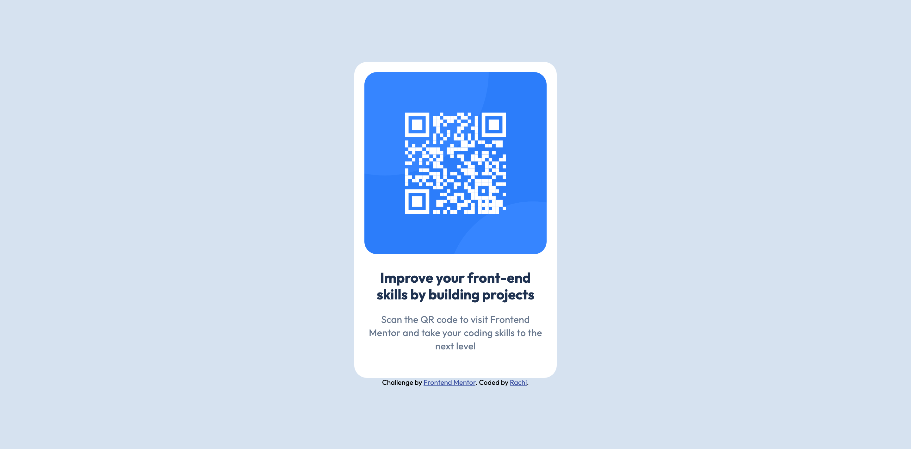

# Frontend Mentor - QR code component solution

This is a solution to the [QR code component challenge on Frontend Mentor](https://www.frontendmentor.io/challenges/qr-code-component-iux_sIO_H). Frontend Mentor challenges help you improve your coding skills by building realistic projects.

## Table of contents

- [Overview](#overview)
  - [Screenshot](#screenshot)
  - [Links](#links)
- [My process](#my-process)
  - [Built with](#built-with)
  - [What I learned](#what-i-learned)
  - [Continued development](#continued-development)
  - [AI Collaboration](#ai-collaboration)
- [Author](#author)

## Overview

### Screenshot



### Links

- Solution URL: [https://www.frontendmentor.io/solutions/frontend-mentor-qr-code-component-challenge-gL0ygiomcC](https://www.frontendmentor.io/solutions/frontend-mentor-qr-code-component-challenge-gL0ygiomcC)
- Live Site URL: [https://venrachi.github.io/qr-code-component/](https://venrachi.github.io/qr-code-component/)

<!-- TODO: fill in your Frontend Mentor solution URL and your deployed live site URL (e.g. from GitHub Pages, Vercel, or Netlify). -->

## My process

### Built with

- Semantic HTML5 markup
- CSS3 (Flexbox)
- Mobile-first, fully responsive layout

### What I learned

This was one of my first projects, and I came away with a much stronger grip on layout fundamentals that I'd only seen mentioned before without really understanding.

**Flexbox has two separate axes to control.** I originally only knew about `align-items`, and couldn't figure out why my card wouldn't center vertically. It turned out `align-items` controls the *cross axis*, while `justify-content` controls the *main axis* — which one is "vertical" actually depends on `flex-direction`:

```css
body {
  display: flex;
  flex-direction: column;
  align-items: center;      /* centers horizontally (cross axis) */
  justify-content: center;  /* centers vertically (main axis) */
  min-height: 100vh;
}
```

**`height` vs. `min-height`.** Centering had no visible effect at first because `body` had no height at all — it was only ever as tall as its content. I also learned that a hard `height` is risky: if content ever needs more room than that fixed value, it can overflow or overlap instead of the box adapting. `min-height: 100vh` fixes both problems at once — it gives the body room to center within, while still letting it grow taller if it ever needs to.

**Heading levels aren't just for size/boldness.** I originally reached for an `<h4>` because it "looked right" at a smaller size, before learning that heading levels form a hierarchy that screen reader users navigate by — skipping straight to `<h4>` with nothing above it breaks that. Since this card has only one heading, `<h1>` was the correct choice regardless of how large or small I wanted it to look (font-size is a completely separate concern from heading level).

**Padding stacks between parent and child.** The Figma spec called for 40px of space below the paragraph text, but my `.qr-box` already had `padding: 16px` on every side. Rather than guessing a value, I worked out the remaining amount needed: `40 - 16 = 24px`, and applied that as `padding-bottom` on the inner text wrapper.

**Browser default styles can hide the real problem.** A lot of early confusion (unexpected margins, unexpected fonts looking "the same") traced back to invisible default browser styles I didn't know existed. Adding a simple reset early on made spacing much more predictable:

```css
* {
  box-sizing: border-box;
  margin: 0;
  padding: 0;
}
```

### Continued development

- Get in the habit of adding a CSS reset (`box-sizing`, `margin`, `padding`) at the very start of a project, rather than discovering the need for one partway through.
- Practice sizing images more fluidly (e.g. `width: 100%` + `aspect-ratio`) by default, instead of hardcoding pixel dimensions, so components hold up better at very small or unusual viewport sizes.
- Get more comfortable with responsive design in cases where the mobile and desktop designs actually differ, since this challenge's two designs happened to be identical.

### AI Collaboration

I used Claude (Anthropic's AI coding assistant) throughout this project as a learning mentor rather than a code generator.

- **How I used it:** Whenever I got stuck (centering issues, sizing the QR image, CSS selectors not working, choosing the right HTML tags), I described what I was seeing and asked for help. Instead of giving me finished code, it asked me questions to help me figure out the underlying concept myself, and gave me small hints and analogies until I could work out the fix in my own code.

## Author

- Frontend Mentor - [@venrachi](https://www.frontendmentor.io/profile/venrachi)

